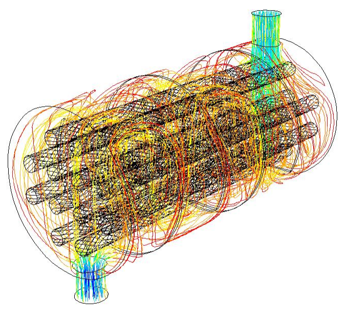

# 🌡️ Shell & Tube Heat Exchanger Fouling Dataset

Simulated dataset of **thermal fouling resistance over time** in a Shell & Tube heat exchanger, generated using the **Epstein (1993) Arrhenius + shear-removal model**. Designed for predictive maintenance, thermal degradation modeling, and ML benchmarking.


---

## 📐 Physical Model

The fouling resistance Rf [m²·K/W] evolves according to:

```
dRf/dt = A_dep · exp(−E_dep / RT) − A_rem · τ_w · Rf
```

| Term | Description | Source |
|------|-------------|--------|
| `A_dep · exp(−E_dep/RT)` | Arrhenius deposition rate | Polley et al. (2002) |
| `A_rem · τ_w · Rf` | Shear-driven removal | Kern & Seaton (1959) |
| `τ_w = (f/8) · ρ · u²` | Wall shear stress (Blasius) | Incropera & DeWitt (2002) |
| `U = 1 / (1/U_clean + Rf)` | Degraded overall HTC | Fouling factor definition |

This is an **asymptotic fouling model**: deposition dominates at startup, removal grows with Rf until steady state.

---

## 🔧 Heat Exchanger Geometry

| Parameter | Value | Unit |
|-----------|-------|------|
| Type | Shell & Tube, single-pass counter-flow | — |
| Tube inner diameter | 19 | mm |
| Tube outer diameter | 22 | mm |
| Tube length | 4.88 | m |
| Number of tubes | 100 | — |
| Heat transfer area | ~29.1 | m² |

---

## 💧 Fluid & Operating Conditions

| Parameter | Value | Unit |
|-----------|-------|------|
| Fluid | Water-based process fluid | — |
| Density (ρ) | 980 | kg/m³ |
| Dynamic viscosity (μ) | 3.5×10⁻⁴ | Pa·s |
| Thermal conductivity | 0.644 | W/m·K |
| Mass flow rate | 5.0 | kg/s |
| Reynolds number | ~16,000 (turbulent) | — |
| T_in range | 50 – 125 | °C |
| Simulation horizon | 8,760 | h (1 year) |
| Mass flow rate (nominal) | 3.0 – 7.0 | kg/s |
---

## 📊 Dataset Columns

| Column | Unit | Description |
|--------|------|-------------|
| `T_in_C` | °C | Fluid inlet temperature |
| `T_in_K` | K | Fluid inlet temperature (Kelvin) |
| `time_h` | h | Simulation time (hourly) |
| `Re` | — | Reynolds number |
| `u_m_s` | m/s | Flow velocity |
| `tau_w_Pa` | Pa | Wall shear stress |
| `Rf_m2K_W` | m²·K/W | Fouling resistance |
| `U_overall_W_m2K` | W/m²·K | Degraded overall heat transfer coefficient |
| `U_clean_W_m2K` | W/m²·K | Clean (initial) heat transfer coefficient |
| `Q_W` | W | Heat duty |
| `Q_clean_W` | W | Reference clean heat duty |
| `thermal_efficiency` | — | Q / Q_clean ratio |
| `dP_Pa` | Pa | Pressure drop (Darcy-Weisbach) |
| `fouling_factor_TEMA` | — | TEMA fouling severity class (L/H) |
| `scenario_id`         | —         | Unique scenario identifier (e.g. T100_Q5.0) |
| `m_dot_nominal_kg_s`  | kg/s      | Nominal mass flow rate — scenario variable |
| `R_wall_m2K_W`        | m²·K/W    | Tube wall resistance — grows with corrosion (Arrhenius) |
| `U_total_W_m2K`       | W/m²·K    | Overall HTC including fouling + wall corrosion |
| `Q_total_W`           | W         | Heat duty accounting for all degradation sources |
| `efficiency_total`    | —         | Q_total / Q_clean — combined degradation efficiency |
| `degradation_source`  | —         | Dominant degradation: `fouling`, `corrosion`, or `combined` |
---

## 📚 References

1. **Epstein, N.** (1993). The fouling of heat exchangers. *14th International Heat Transfer Conference*, Washington D.C.
2. **Polley, G.T., Wilson, D.I., Yeap, B.L., Pugh, S.J.** (2002). Evaluation of laboratory fouling data for application to crude oil preheat trains. *Chemical Engineering Research and Design*, 80(7), 713–727.
3. **Kern, D.Q., Seaton, R.E.** (1959). A theoretical analysis of thermal surface fouling. *British Chemical Engineering*, 4(5), 258–262.
4. **Incropera, F.P., DeWitt, D.P.** (2002). *Fundamentals of Heat and Mass Transfer*, 5th ed. Wiley.
5. **Sinnott, R.K.** (2005). *Chemical Engineering Design*, 4th ed. Elsevier.
   (tube wall corrosion resistance model)
---

## 🚀 Reproduce It

```bash
git clone https://github.com/YOUR_USERNAME/shell-tube-fouling
cd shell-tube-fouling
pip install -r requirements.txt
python simulate_fouling.py
# → output/shell_tube_fouling_dataset.csv
```

---

## 🎯 Suggested ML Tasks

- **Regression:** Predict `Rf` or `thermal_efficiency` given `T_in_C` and `time_h`
- **Classification:** Predict TEMA fouling class (`L` or `H`)
- **Time-series:** Forecast fouling curve to schedule maintenance
- **Anomaly detection:** Detect abnormal fouling rate

---

## License

Released under **CC0 1.0 Universal (Public Domain)**. Use freely for research and commercial purposes.
